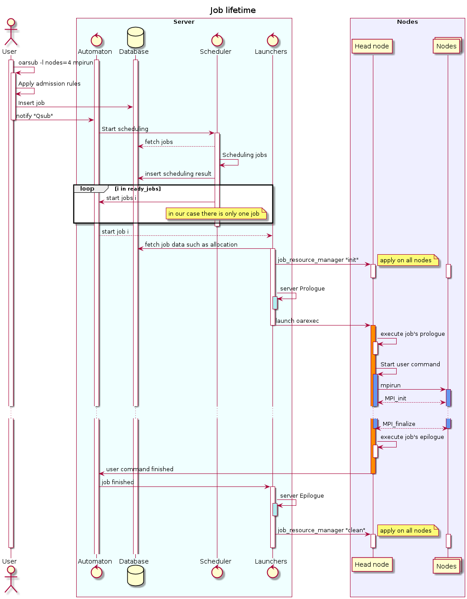
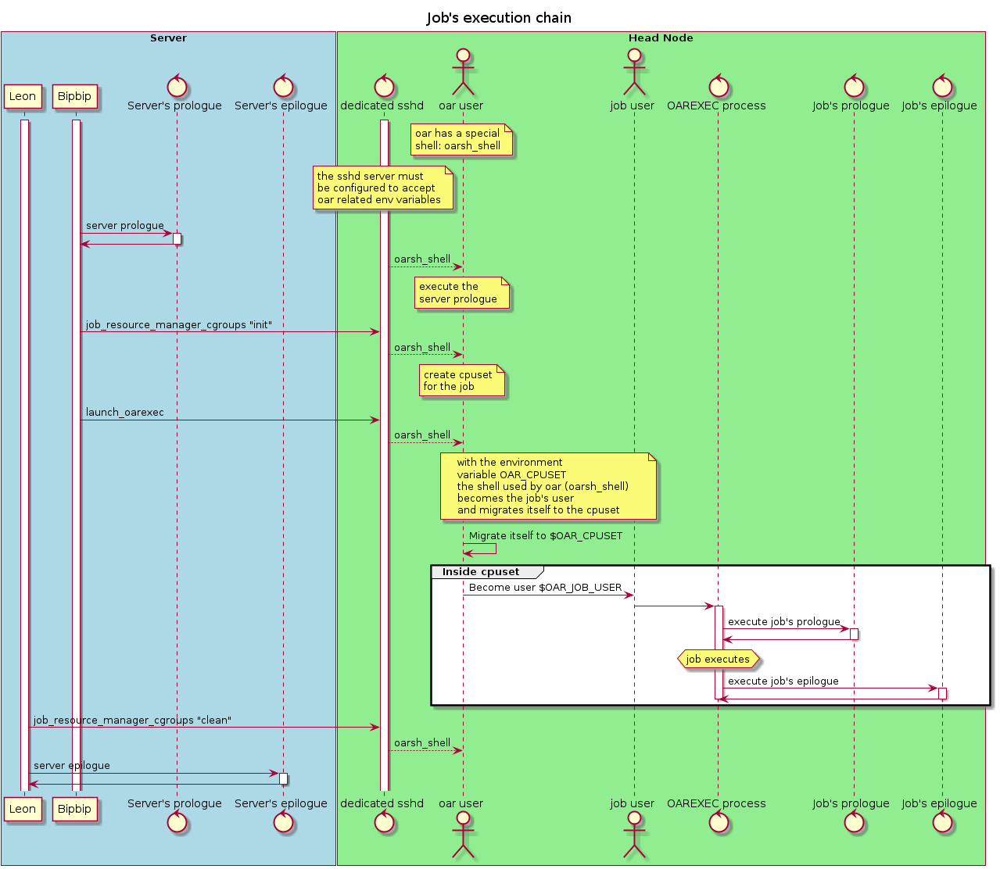
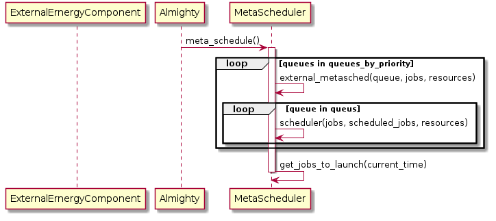

Technical details and diagrams
==============================

One part of the complexity of oar comes from its distributes nature. Sequence diagrams help to understand the temporality of the actions done by oar to perform specific actions.
Note, that sequence diagram are helpful to visualize chain of actions in the time, however it shows a specific scenario, and thus is not exhaustive.

Job lifetime
------------

This diagram illustrate the job lifetime in the system. The user is connected with `ssh` on a frontend. The ``Automaton`` (:ref:`almighty <api-module-almighty>`), ``Scheduler`` (:ref:`meta scheduler <api-kao-meta_sched>`) and ``Launchers`` (:ref:`bipbip commander<api-module-bipbip_commander>`) are oar modules running on the server. ``Head node`` and ``Nodes`` are the nodes allocated to the job.

1. The job is first submitted by an user using the command ``oarsub``. This command executes locally the checks on the job, and executes the admission rules configured. Once the job has been processed, it is inserted into the database. Additionally, a notification is sent to the ``automaton`.
2. A scheduling phase starts, to process waiting jobs. The jobs are directly fetched in the database.
3. At the end of the scheduling, the scheduler notifies the automaton to start the job that are ready by starting a ``launcher`` (`oar/modules/bipbip.py`).
4. The launcher retrieves information about the job from the database (the allocated node, the user command etc). Before starting the job, the ``launcher`` inits the nodes (using the script `oar/tools/job_resource_manager_cgroups.pl`). Before starting  the job, the ``launcher`` runs a `server prologue` (if configured) on the server.
5. One node is selected as the ``Head node`` which holds the main job's process ``oarexec`` (`oar/tools/oarexec`). ``oarexec`` is responsible for launching the job's prologue (if configured by an administrator) and the user command.
6. In the presented scenario, the user's command finishes. It is detected by ``oarexec`` as the end of the job. ``oarexec`` launches the job's epilogue if configured, and notifies the ``automaton`` for the end of the job.
7. Finally, a ``launcher`` is start to handle the end of the job: it runs a server prologue if necessary, and clean the nodes used by the job.

   Sequence diagram of the lifetime of a job. Click on the image to see a bigger version.

Job execution chain
-------------------

This diagram illustrate how oar launches a job. The module (:ref:`Bipbip<api-module-bipbip>`) is in charge of launching a job. Oar accesses the node using a dedicated `sshd` server that executes on the node. When the server connects to a node using the dedicated `sshd` server, the script ``oar_shell`` is executed (it is configured to be the default shell for the user oar). Additionally, the dedicated `sshd` server is configured to forward some environment variables from the server to the nodes. ``oarexec`` (`oar/tools/oarexec`) is the main program started by oar on the head node of a job (every job as one head node). `oarexec` is responsible for launching and managing the user job process (only on the head node). If the user process ends, ``oarexec`` notifies oar to end the job.

   Sequence diagram of the mechanisms used by oar to launch a job. Click on the image to see a bigger version.

Metascheduler communication with external module
------------------------------------------------

   Click on the image to see a bigger version.